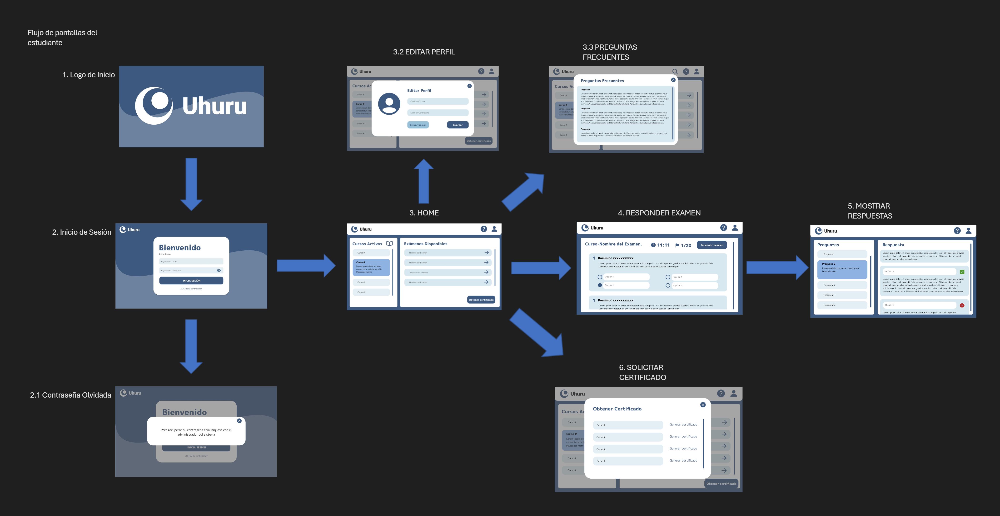
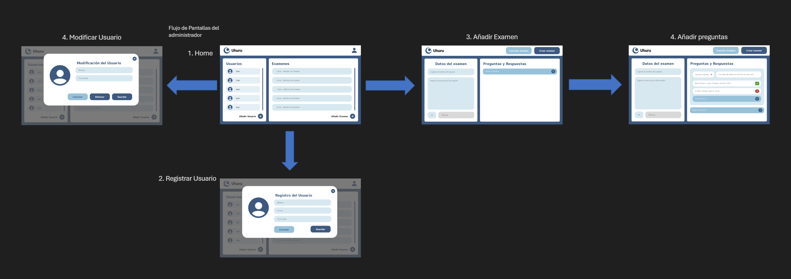
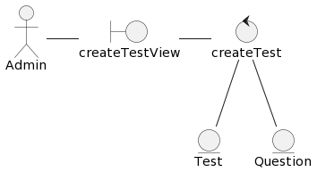
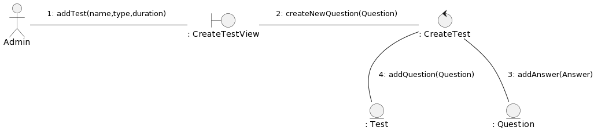
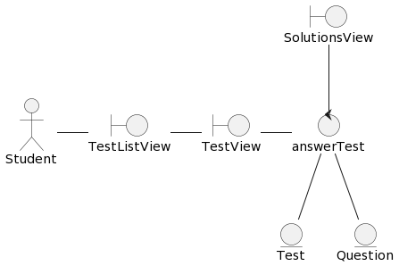
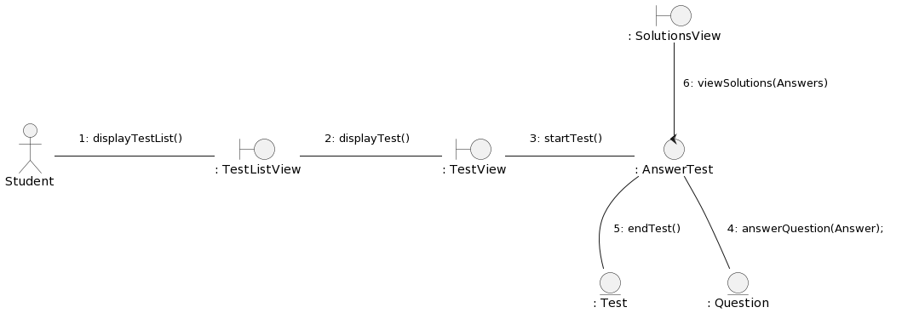
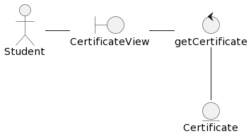
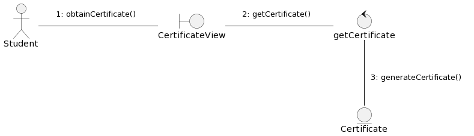
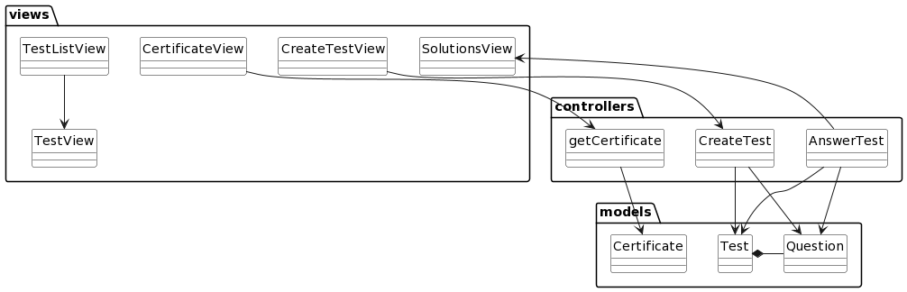

# Uhuru
Aplicación de Escritorio para gestión y práctica de exámenes de certificación.

## Integrantes
+ Cao Carlos
+ Carios César
+ Ciavato Miguel
+ Homsany Jhonatan
+ Reis Erimar

#Enlaces
1. [ Modelos de Dominio. ](#modelo_dominio)
2. [ Modelos de Casos de Uso](#use_case)
4. [ Protipos de interfaz ](#prototipos)
5. [ Modelos de Análisis](#modelo_analisis)
6. [ Modelos de Diseño](#modelo_diseño)
7. [ Librerías](#lib)
8. [ Como usar](#guia)

## Modelo del dominio
### Diagrama de clases

  

### Diagrama de estado

  

## Modelo de Casos de Uso
## Diagrama de Casos de Uso

  

### Diagrama de Estados de los casos de uso

  

### Especificaciones de los casos de uso

  
  
  

## Prototipo de pantallas
### Flujo de Usuario

### Flujo de Administrador
      
### Enlaces 
- [Prototipo Interactivo en Figma](https://www.figma.com/file/dzXOa9yDAVZmEWpZJqrHQO/Prototipo-De-Interfaz?type=design&node-id=0%3A1&mode=design&t=nIYMdCu8Bfcdtu5P-1)
- [Pantallas](docs/prototype/INTERFACE.md)

## Modelo de Análisis
### Diagrama de clases de analisis

  

### Diagrama de clases de análisis y de colaboración de casos de uso prioritarios 

#### UC1 - Crear Examen

  
  

#### UC2 - Responder Examen

  
  

#### UC3 - Obtener Certificado

  
  

### Diagrama de paquetes de análisis

  

## Modelo de Diseño
### Diagrama de clases

  

### Diagrama de secuencia

  

### Diagrama de Traza

  

## Modelo de Despliegue

  

##Librerías

##Como usar Uhuru